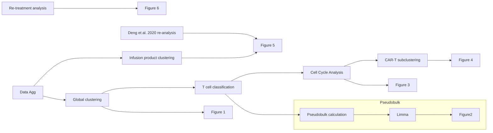

# Haradhvala_et_al_2022

Scripts to generate figures presented in paper are stored in figures/
Analyses

```mermaid
flowchart LR
    agg[Data Agg] --> global[Global clustering]
    global ---> fig1[Figure 1]

    global ---> classification[T cell classification]
    classification ---> preppseudo[Pseudobulk calculation]
    
    subgraph ide1 [Pseudobulk]
    preppseudo ---> limma[Limma]
    limma ---> fig2[Figure2]
    end

    classification ---> cellcycle[Cell Cycle Analysis]
    cellcycle ---> fig3[Figure 3]

    cellcycle ---> subclust[CAR-T subclustering]
    subclust ---> fig4[Figure 4]
    
    agg ---> ip[Infusion product clustering]
    ip ---> fig5[Figure 5]
    deng[Deng et al. 2020 re-analysis] ---> fig5
    
    retreat[Re-treatment analysis] ---> fig6[Figure 6]

```

