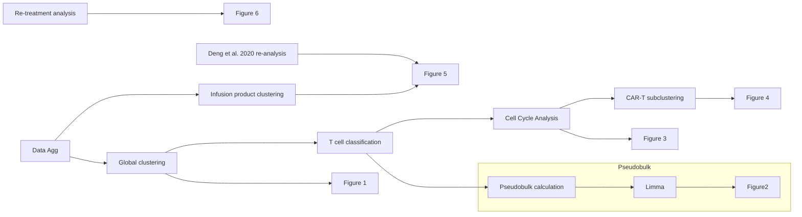

# Haradhvala_et_al_2022

Scripts to generate figures presented in paper are stored in figures/
Analyses

Data aggregation
Global pre-processing
CD4/CD8 classification

## Pseudo-bulk differential expression
### Data preparation
### Run limma

## Cell cycle analysis
## CD45RA/RO classification
## Cell subset annotation

## CAR-T sub-clustering

## Re-treatment patient clustering

## IP clustering

Figure 1
Figure 2
Figure 3
Figure 4
Figure 5
Figure 6

